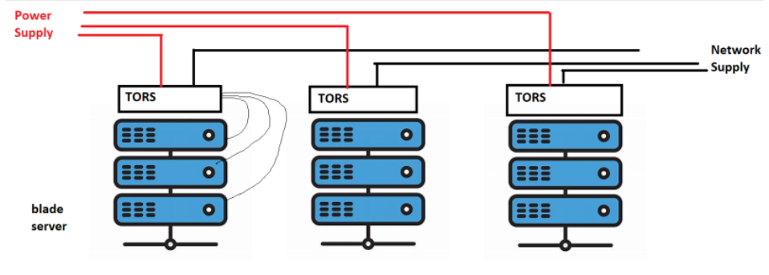
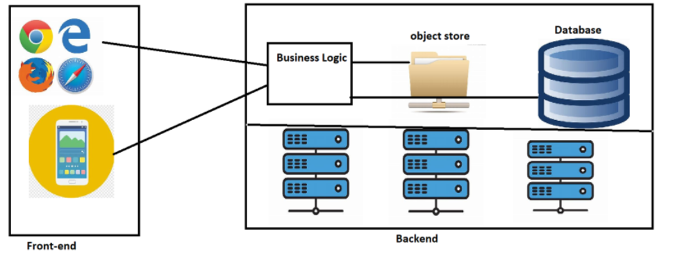
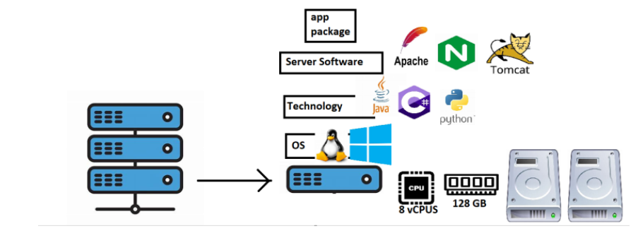
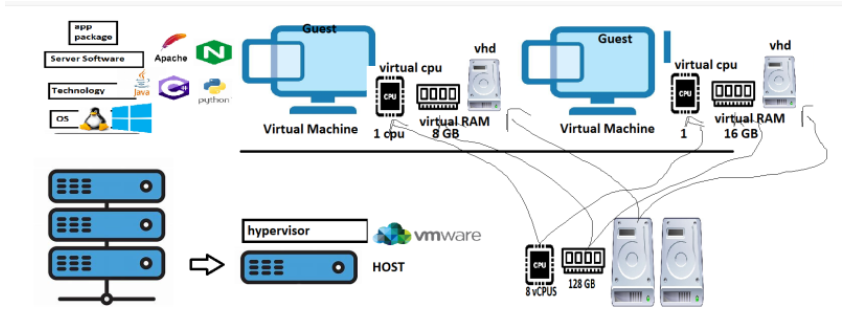

##                    Gromming-class-Devops                                      ##

## Grooming Sessions for DevOps and Cloud Engineers

## Skills

* Ensure Applications run smoothly
    * Troubleshooting 
    * Servers
          * Web Servers
          * Application Servers
          * Database Servers
          * Clusters

* Embracing Commandline
    * windows 
    * Linux
    * ios

* Datacenters
    * On-premises
    * Cloud

* Virtualizations
* Network
* Storage
* Installations/Configurations

## Datacenter

* Datacenter has collection of servers organized in racks
* Each rack gets parallel power and network connection
* Each rack has a TORS (Top of the rack switch) to distribute the network to multiple servers in rack
* In Racks we use blade servers

## Application (PVR movies)

* The architecture of pvr movies
  

## How to run the application on Servers ?

* Applications can be deployed on the servers
* Approach 1:
      * Directly install os on Physical servers

* Problem: ROI is time taking

* Approach 2: Hypervisors:
      * Hypervisors help us in creating virtual machines

 

## Terms

* Capex (Capital expenditure)
* Opex (Operational expenditure)
* ROI (Return On Investment)
* Deploy
* Hypervisor 
* BCDR (Business Continuity and Disaster Recovery)
