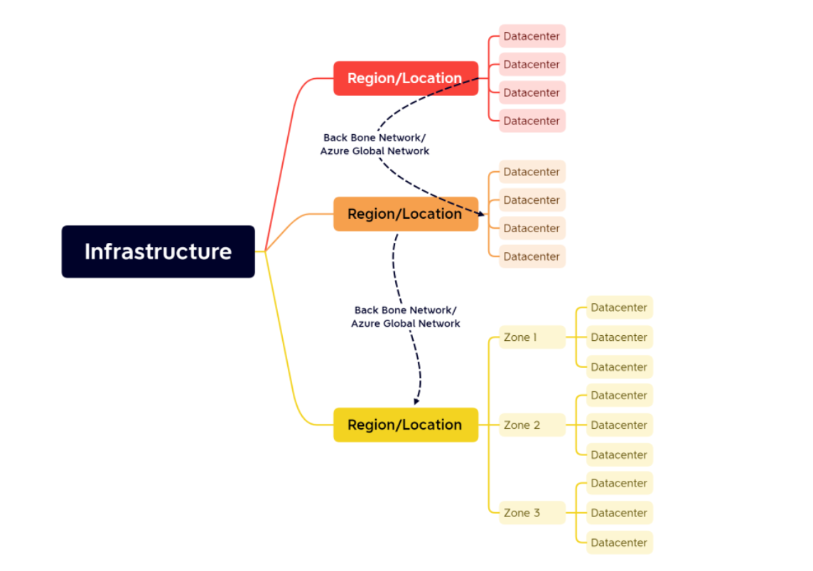
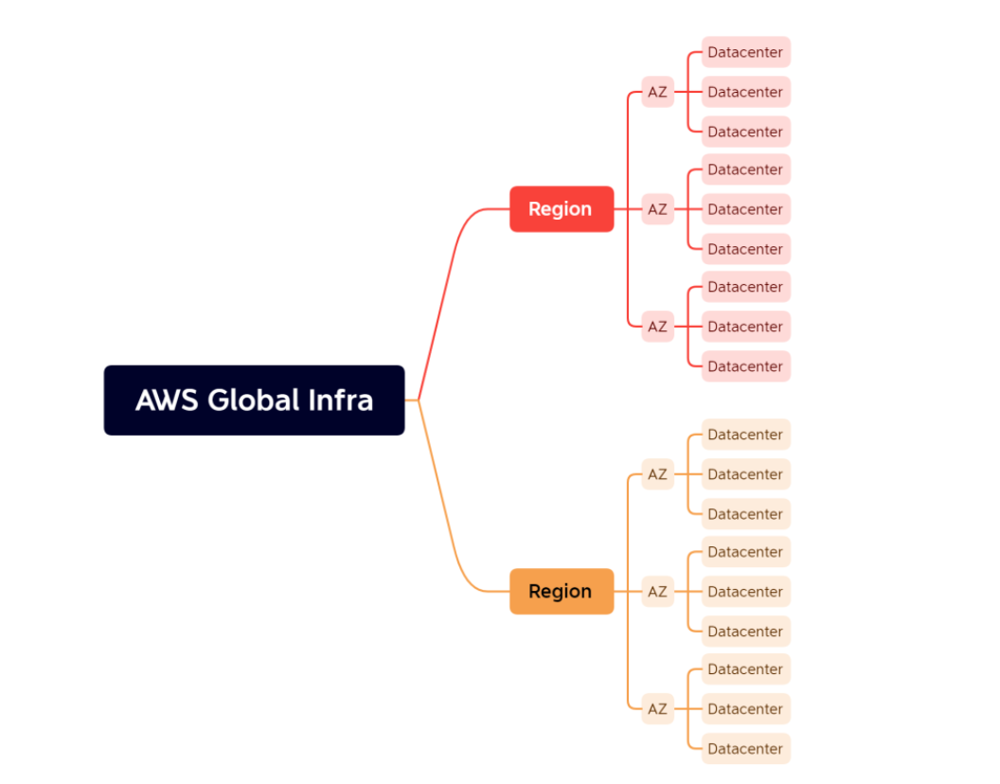
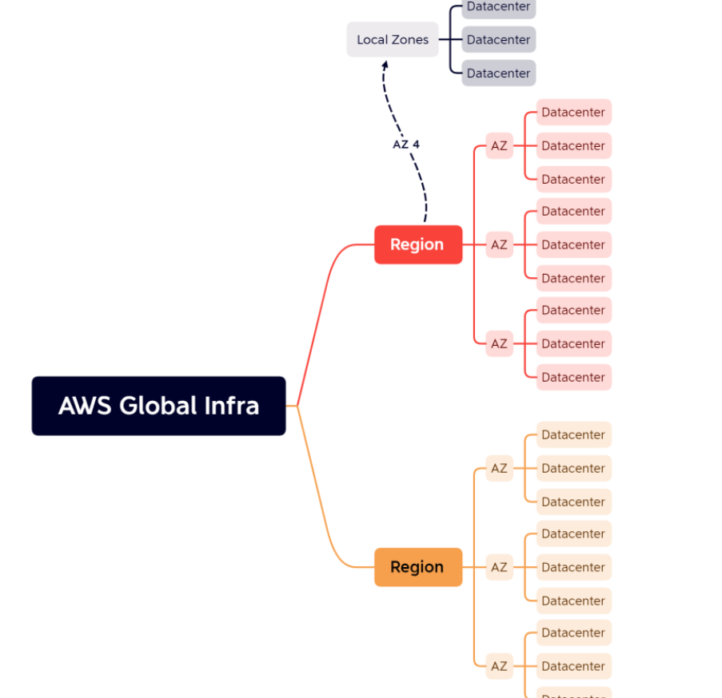

## class 2

* ## Hypervisors

* Hypervisor is a software to create virtual machines
* There are two types of hypervisors
    * Type 1: 
         * Which we install directly on a physical server
         * This acts as os and creates virtual machines
         * Examples: VmWare ESxi
  
    * Type 2: 
         * This is installed on Operating Systems and helps in creating virtual machines
         * Examples: Hyper V, VmWare Workstation, Parallels

## Global Network

* Azure Global Network: https://datacenters.microsoft.com/  Here for global infrastructure
  
* Azure has two types of Regions
       * Region: Collection of Datacenters
       * Region with zones:
         * Each zone is collection of Datacenters
         * Between two zones the distance will be 30 – 60 kms far away 

* Azure has a backbone network called as Azure Global Network which connects every region via high speed network cables owned by microsoft for azure

* __Edge locations:__

* On-Premise Connectivity
* Edge Locations/Content Delivery Networks

## AWS Global Infrastructure

* Regions

 

* Local Zones: To have more locational presence
  

* Edge network: https://aws.amazon.com/cloudfront/features/?whats-new-cloudfront.sort-by=item.additionalFields.postDateTime&whats-new-cloudfront.sort-order=desc#Global_Edge_Network

## Credentials

* Username/Password
* Username/keypair
* token

## Terms

* Latency
* Content Delivery Networks:
     * Origin Server
     * Point of Presence Servers/Edge Servers

## class video link: 
refer: https://www.youtube.com/watch?v=Am33Z-WCKOw

## Exercise: Watch the video to install softwares on your laptop
refer: https://www.youtube.com/watch?v=9guzVbZPGuw&t=703s  